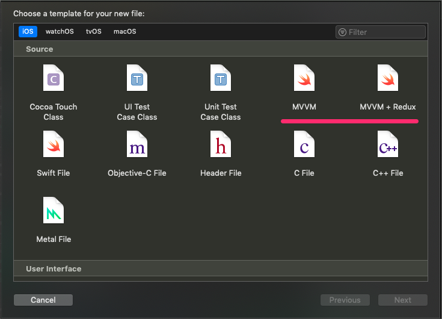

# iOS File templates
File templates for Xcode projects

Instruction:
Move .xctemplate directories to /Applications/Xcode.app/Contents/Developer/Library/Xcode/Templates/File Templates/Source/ directory. Then it should appear in window where you choose file templates:

